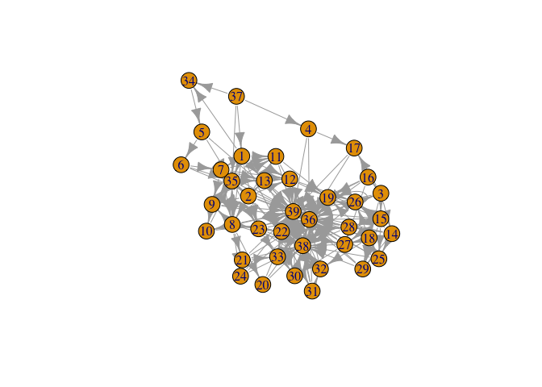
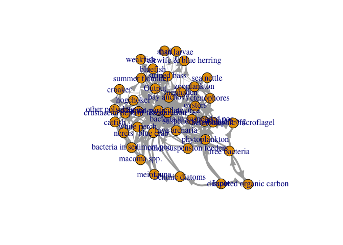
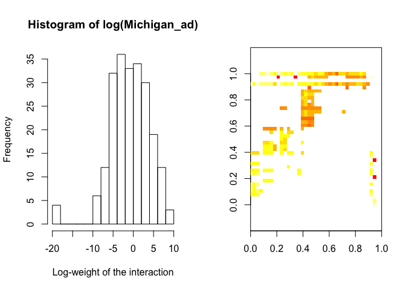

# Readin data from Pajek projects
Giulio Valentino Dalla Riva  
June 27, 2016  


## Getting the good stuff out the messy format

In the zoo of format encoding food webs, _pajek_ is not my cup of tea. For one thing, it does not really cope well with **igraph**. And I like **igraph**. Alas!, a lot of old data is still available only as a Pajek project, so we are going to extract an `igraph` object from a Pajek project file (usually they are recognisable for the `.paj` suffix).

We will need some of the classic R libraries and three libraries, `network` to handle Pajek files, `igraph` for producing the desired data structures and `intergraph` to translate between Pajek and igraph.


```r
required_packages <- c("network",
                       "igraph",
                       "intergraph",
                       "magrittr",
                       "dplyr",
                       "reshape2",
                       "purrr")

source("../../R/ancillary.R") #provides try_and_install
try_and_install(required_packages)
```

```
## [1] "Nothing to install."
```

```r
library(magrittr)
```

We are using an interesting set of weighted Food Web, put together by (Vladimir Batagelj)[http://vlado.fmf.uni-lj.si/pub/networks/data/bio/foodweb/foodweb.htm] in 2004. To explain the translation, we already manually downloaded and unzipped the _Food webs_ (`Webs_paj.zip`) file to a local folder (`[Project]/Data/Elaborated/paj/`).

Read in pajek networks with `network` and translate them to `igraph` objects with `intergraph`:


```r
Cheaspeake_File <- '../../Data/Elaborated/paj/Chesapeake.paj'
Graph_test <- Cheaspeake_File %>% network::read.paj()
Graph_test %>% summary()
```

```
##            Length Class      Mode
## networks   1      -none-     list
## partitions 1      data.frame list
```

```r
Graph_test$networks[[1]] %>% summary()
```

```
## Network attributes:
##   vertices = 39
##   directed = TRUE
##   hyper = FALSE
##   loops = TRUE
##   multiple = FALSE
##   bipartite = FALSE
##   title = chesapeake
##  total edges = 177 
##    missing edges = 0 
##    non-missing edges = 177 
##  density = 0.1163708 
## 
## Vertex attributes:
##   vertex.names:
##    character valued attribute
##    39 valid vertex names
## 
## Edge attributes:
## 
##  chesapeake:
##    numeric valued attribute
##    attribute summary:
##     Min.  1st Qu.   Median     Mean  3rd Qu.     Max. 
##      0.2     15.1    301.4  23260.0   7851.0 623600.0 
## 
## Network edgelist matrix:
##        [,1] [,2]
##   [1,]   37    1
##   [2,]   37    4
##   [3,]   37   34
##   [4,]   37   35
##   [5,]    8   38
##   [6,]   12   38
##   [7,]   13   38
##   [8,]   19   38
##   [9,]   20   38
##  [10,]   21   38
##  [11,]   22   38
##  [12,]   23   38
##  [13,]   24   38
##  [14,]   25   38
##  [15,]   26   38
##  [16,]   27   38
##  [17,]   28   38
##  [18,]   29   38
##  [19,]   30   38
##  [20,]   31   38
##  [21,]   32   38
##  [22,]   33   38
##  [23,]    1   39
##  [24,]    2   39
##  [25,]    3   39
##  [26,]    4   39
##  [27,]    5   39
##  [28,]    6   39
##  [29,]    7   39
##  [30,]    8   39
##  [31,]    9   39
##  [32,]   10   39
##  [33,]   11   39
##  [34,]   12   39
##  [35,]   13   39
##  [36,]   14   39
##  [37,]   15   39
##  [38,]   16   39
##  [39,]   17   39
##  [40,]   18   39
##  [41,]   19   39
##  [42,]   20   39
##  [43,]   21   39
##  [44,]   22   39
##  [45,]   23   39
##  [46,]   24   39
##  [47,]   25   39
##  [48,]   26   39
##  [49,]   27   39
##  [50,]   28   39
##  [51,]   29   39
##  [52,]   30   39
##  [53,]   31   39
##  [54,]   32   39
##  [55,]   33   39
##  [56,]    1    7
##  [57,]    1    8
##  [58,]    1   11
##  [59,]    1   12
##  [60,]    1   13
##  [61,]    1   22
##  [62,]    1   23
##  [63,]    1   34
##  [64,]    1   35
##  [65,]    2    7
##  [66,]    2    8
##  [67,]    2    9
##  [68,]    2   11
##  [69,]    2   12
##  [70,]    2   13
##  [71,]    2   22
##  [72,]    2   23
##  [73,]    2   35
##  [74,]    2   36
##  [75,]    3   14
##  [76,]    3   15
##  [77,]    3   16
##  [78,]    3   17
##  [79,]    3   18
##  [80,]    3   36
##  [81,]    4   17
##  [82,]    4   36
##  [83,]    5    6
##  [84,]    5   35
##  [85,]    6    7
##  [86,]    6   35
##  [87,]    7    8
##  [88,]    7    9
##  [89,]    7   11
##  [90,]    7   12
##  [91,]    7   13
##  [92,]    7   35
##  [93,]    8    9
##  [94,]    8   10
##  [95,]    8   20
##  [96,]    8   21
##  [97,]    8   22
##  [98,]    8   23
##  [99,]    8   24
## [100,]    8   35
## [101,]    9   10
## [102,]    9   35
## [103,]    9   36
## [104,]   10   35
## [105,]   10   36
## [106,]   11   19
## [107,]   11   36
## [108,]   12   19
## [109,]   12   26
## [110,]   12   36
## [111,]   13   36
## [112,]   14   25
## [113,]   14   26
## [114,]   14   27
## [115,]   14   28
## [116,]   14   29
## [117,]   14   36
## [118,]   15   19
## [119,]   15   25
## [120,]   15   26
## [121,]   15   27
## [122,]   15   28
## [123,]   15   29
## [124,]   15   36
## [125,]   16   19
## [126,]   16   27
## [127,]   16   36
## [128,]   17   36
## [129,]   18   19
## [130,]   18   25
## [131,]   18   26
## [132,]   18   27
## [133,]   18   29
## [134,]   18   32
## [135,]   18   36
## [136,]   19   19
## [137,]   19   33
## [138,]   19   36
## [139,]   20   36
## [140,]   21   33
## [141,]   21   36
## [142,]   22   27
## [143,]   22   28
## [144,]   22   30
## [145,]   22   31
## [146,]   22   32
## [147,]   22   33
## [148,]   22   36
## [149,]   23   30
## [150,]   23   32
## [151,]   23   33
## [152,]   23   36
## [153,]   24   36
## [154,]   25   36
## [155,]   26   36
## [156,]   27   30
## [157,]   27   36
## [158,]   28   36
## [159,]   29   36
## [160,]   30   36
## [161,]   31   32
## [162,]   31   36
## [163,]   32   36
## [164,]   33   36
## [165,]   34    5
## [166,]   35    2
## [167,]   35    7
## [168,]   35    8
## [169,]   35    9
## [170,]   35   11
## [171,]   35   12
## [172,]   35   13
## [173,]   35   22
## [174,]   35   23
## [175,]   35   36
## [176,]   36    3
## [177,]   36   19
```

```r
Net_test <- Graph_test$networks[[1]]
iGraph_test <- Net_test %>% intergraph::asIgraph()
```

Have we done it? Let's get a look to the graph:


```r
iGraph_test %T>%
  summary %>%
  plot
```

```
## IGRAPH D--- 39 177 -- 
## + attr: title (g/c), na (v/l), vertex.names (v/c), chesapeake
## | (e/n), na (e/l)
```

<!-- -->

Where are the edge weights?


```r
iGraph_test %>% igraph::list.edge.attributes()
```

```
## [1] "chesapeake" "na"
```

```r
iGraph_test %>% igraph::list.vertex.attributes()
```

```
## [1] "na"           "vertex.names"
```

Well, there seems to be something, but not really clear what.
Let's take a better look.


```r
igraph::V(iGraph_test)$vertex.names %>% head
```

```
## [1] "phytoplankton"             "bacteria in suspended poc"
## [3] "bacteria in sediment poc"  "benthic diatoms"          
## [5] "free bacteria"             "heterotrophic microflagel"
```

```r
igraph::V(iGraph_test)$na %>% summary
```

```
##    Mode   FALSE    NA's 
## logical      39       0
```

```r
igraph::E(iGraph_test)$na %>% summary
```

```
##    Mode   FALSE    NA's 
## logical     177       0
```

```r
igraph::E(iGraph_test)$chesapeake %>% summary
```

```
##     Min.  1st Qu.   Median     Mean  3rd Qu.     Max. 
##      0.2     15.1    301.4  23260.0   7851.0 623600.0
```

So, the interaction weights seems to be in `chesapeake`---the variable we are interested in changes name for each food web!---the `na` are all `FALSE` logicals---we can safely ignore them---and `vertex.names` are the names of the nodes in the food web. Let's remove the useless stuff and clear up things.


```r
igraph::V(iGraph_test)$name <- igraph::V(iGraph_test)$vertex.names
weight_name <- igraph::get.edge.attribute(iGraph_test)[1] %>% names
weights <- igraph::get.edge.attribute(iGraph_test,weight_name) %>% as.vector
iGraph_test %<>% igraph::set_edge_attr("weight", value = weights)
iGraph_test %<>% igraph::remove.edge.attribute("na") %>%
  igraph::remove.edge.attribute(weight_name) %>%
  igraph::remove.vertex.attribute("na") %>%
  igraph::remove.vertex.attribute("vertex.names")
```

We start seeing something:


```r
iGraph_test %>% igraph::plot.igraph(
                     edge.width=log(igraph::E(iGraph_test)$weight)/3,
                     edge.curved=TRUE
                     )
```

<!-- -->

Well, the plot is horrible but everything is there. Now let's get the weighted adjacency back and let's forget pajek!


```r
Adjacency_test <- iGraph_test %>%
  igraph::get.adjacency(attr = "weight",
                sparse = F)
```

Quick sanity test: do we have the same number of edges and vertices?


```r
dim(Adjacency_test)[1] == igraph::vcount(iGraph_test)
```

```
## [1] TRUE
```

```r
sum(Adjacency_test > 0) == igraph::ecount(iGraph_test)
```

```
## [1] TRUE
```

Cool, now we can do science.

Let's wrap everything up in a function:


```r
adjacency_from_paj <- function(name,base){
  
  Net_paj <- network::read.paj(paste0(base,name))
  Net_net <- Net_paj$networks[[1]]
  Web <- intergraph::asIgraph(Net_net)
  
  igraph::V(Web)$name <- igraph::V(Web)$vertex.names
  weight_name <- names(igraph::get.edge.attribute(Web)[1])
  weights <- as.vector(igraph::get.edge.attribute(Web,weight_name))
  Web <- igraph::set_edge_attr(Web,"weight", value = weights)
  Web <- igraph::remove.edge.attribute(Web,"na")
  Web <- igraph::remove.edge.attribute(Web,weight_name)
  Web <- igraph::remove.vertex.attribute(Web,"na")
  Web <- igraph::remove.vertex.attribute(Web,"vertex.names")
  
  Adjacency_test <- igraph::get.adjacency(Web,attr = "weight",sparse = F)
  
  return(Adjacency_test)
}
```

and let's test it:


```r
Michigan_ad <- adjacency_from_paj("Michigan.paj","../../Data/Elaborated/paj/")
sum(Michigan_ad > 0)
```

```
## [1] 221
```

```r
max(Michigan_ad, na.rm = T)
```

```
## [1] 8306.155
```

We can, for example, give a look at the distribution of the weights in the Michigan Food Web:


```r
par(mfrow=c(1,2))
hist(log(Michigan_ad),
     breaks = 10,
     xlab = "Log-weight of the interaction")
image(log(Michigan_ad), 
      asp = 1,
      xlim = c(0,1),
      ylim = c(0,1))
```

<!-- -->

As expected from theory, they are (roughly) log-normal, and there may be some significant nestedness?

A slightly improved version of `adjacency_from_paj()` is available from `io.R` : it works exactly as the one I showcased here but performs a bunch of additional pre-processing tests as the dataset we intend to use is even more messy than what we thought. Isn't that always the case?
